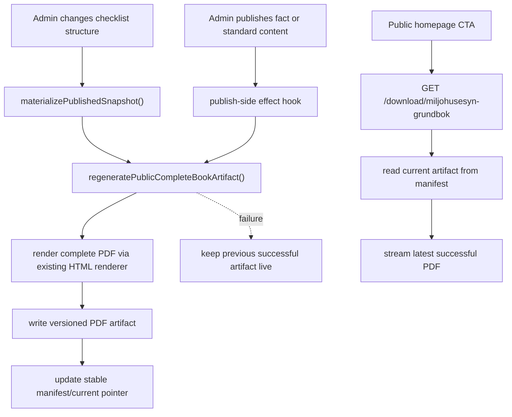

# Public cached complete-book PDF on the homepage with admin-driven regeneration

## Overview

Expose a public, no-login download on the homepage for the full Miljöhusesyn base PDF with no user answers filled in. The PDF should be pre-generated and served as a cached artifact from the server for fast downloads, and it must be regenerated whenever admin changes affect the underlying checklist book content.

## Problem Frame

The codebase already has two important building blocks, but they are not wired together for the intended public experience.

First, the homepage and shared public shell already advertise a PDF download action, but that action points unauthenticated users to login and authenticated users to `src/routes/download/miljohusesyn/+server.ts`, which generates a user-specific `user-full` PDF. That route is explicitly login-gated and is not the public blank base book.

Second, the PDF layer already supports a `complete` mode through `src/lib/server/services/checklist-complete-book-pdf.ts` and `src/lib/server/services/pdf-export.ts`. In that mode the service renders the full book with all checklists included and without user-specific visibility filtering. That is the right source behavior for the requested “everything included, nothing filled in” PDF, but there is no public route that exposes it anonymously, and no server-side caching/pre-generation strategy to make downloads fast.

The requested outcome is therefore not “make complete export public on demand.” It is “publish one prepared base-book artifact on the server, link it from the first page, and keep it fresh when admins change checklist content.” The plan should preserve quick downloads, avoid repeated heavy rendering on each request, and regenerate only when published content or immediate checklist-structure edits actually change the book.

## Requirements Trace

- R1. The first page must expose a public download link to the blank complete Miljöhusesyn PDF without requiring login.
- R2. The public download must serve a prepared server-side artifact rather than generating the PDF on every request.
- R3. The prepared artifact must represent the `complete` book variant: all included content, no user answers.
- R4. The artifact must be regenerated whenever admin changes affect the rendered book content.
- R5. Regeneration must distinguish between edits that only create drafts/review items and edits that actually change published checklist-book content.
- R6. The implementation must stay compatible with the current HTML-to-PDF pipeline on Node/Render, including current Chrome/Playwright setup.

## Scope Boundaries

- In scope: homepage/public-shell download behavior, public server route for the prepared artifact, cache/manifest storage for the generated PDF, and admin-triggered regeneration hooks.
- In scope: checklist structure mutations that currently call `materializePublishedSnapshot()` immediately from `src/routes/admin/content-studio/checklists/[checklistId]/+page.server.ts`.
- In scope: published fact and standard-content changes that affect complete-book rendering.
- Out of scope: changing the visual design of the complete-book PDF itself.
- Out of scope: building a generic artifact CDN or full publication asset management system for every download type.
- Out of scope: anonymous on-demand rendering of `complete` PDFs per request.

### Deferred to Separate Tasks

- Queue-driven asynchronous regeneration with retry dashboarding if the first pass ships with inline/server-side refresh.
- Extending the same artifact publication model to other PDFs such as QA report or action-plan exports.
- Broader invalidation rules for public news unless later confirmed to be part of the full-book PDF surface.

## Context & Research

### Relevant Code and Patterns

- `src/routes/+page.svelte` and `src/routes/+layout.svelte` already wire a public “download PDF” CTA, but unauthenticated users are sent to `/login?redirectTo=%2Fdownload%2Fmiljohusesyn`.
- `src/routes/download/miljohusesyn/+server.ts` currently requires login with `requireUser(...)` and generates a `user-full` PDF via `generateChecklistCompleteBookHtmlPdf(db, 'miljohusesyn', user.id, 'user-full')`.
- `src/lib/server/services/checklist-complete-book-pdf.ts` already supports `mode: 'complete' | 'user-full'` and loads both checklist/fact content and standard-content blocks for the rendered book. The canonical target order includes prefaces, checklist section, facts, appendices, journals, plan, and glossary.
- `src/lib/server/services/pdf-export.ts` already exposes `generateCompletePdf(...)`, which delegates to `generateChecklistCompleteBookHtmlPdf(..., 'complete')`.
- `src/routes/checklists/[checklistId]/pdf/+server.ts` shows the current privileged export contract: authenticated route, `complete` restricted to admins, and no public artifact serving.
- `src/routes/admin/content-studio/checklists/[checklistId]/+page.server.ts` already calls `materializePublishedSnapshot()` immediately after structure changes, moves, linking, unlinking, and published inline fact mutations. That route family is the strongest existing signal that content changed in a way that can affect the book.
- `src/lib/server/services/content-studio.ts` already distinguishes editorial statuses (`draft`, `in_review`, `published`) for facts, standard content, and news. Published states are the correct hook point for artifact invalidation/regeneration in that flow.

### Institutional Learnings

- In this repo, the live PDF path is the Postgres-backed HTML-to-PDF pipeline, not legacy XML/XSL-FO runtime generation.
- Render deployment already depends on the current browser-backed renderer setup, so the plan should reuse that path rather than introducing a second PDF renderer.
- The repo is a partial Postgres cutover; runtime is Postgres-oriented but test/tooling still carries SQLite scaffolding. Plan verification should avoid claiming more cleanup than actually exists.

### External References

- No external research needed. The repo already contains the core rendering pipeline, public CTA surfaces, and admin mutation flows required for this feature.

## Key Technical Decisions

- Publish a prepared artifact, not a public rendering endpoint: public requests should read a pre-built PDF file plus lightweight metadata, not spawn headless Chrome.
- Treat the artifact as publication output owned by the app server: store a stable “current public base-book PDF” reference plus generation metadata so the route can serve the latest good artifact immediately.
- Regenerate on content publication boundaries, not on every draft save: only checklist structure mutations that materialize immediately and content-studio saves that actually publish should invalidate/regenerate the artifact.
- Reuse the current `complete` rendering path exactly: the public artifact should be generated through `generateChecklistCompleteBookHtmlPdf(..., 'complete')` so there is one canonical base-book renderer.
- Prefer “latest successful artifact stays live” semantics during regeneration: if a regeneration fails, public downloads should continue serving the most recent good PDF until the next successful rebuild.

## Open Questions

### Resolved During Planning

- Should the public base book require login?
  - No. The user request and homepage placement make this a public download.
- Should the PDF be rendered live on each request?
  - No. The intended behavior is a server-prepared artifact for fast download.
- Which export flavor matches the desired blank base book?
  - `complete`, not `user-full`, because `complete` includes full content without user-specific filled answers.

### Deferred to Implementation

- Exact artifact location and manifest format: implementation can choose a simple JSON manifest plus stable PDF path as long as the public route can atomically resolve the latest successful artifact.
- Whether regeneration should be synchronous in publish actions or delegated to a lightweight internal job helper. The plan assumes an internal helper abstraction so implementation can choose direct or deferred execution per trigger.
- Whether news content truly affects the full-book artifact. Current evidence clearly shows facts and standard-content blocks are inputs; news should only be included in regeneration triggers if implementation confirms it is rendered into the complete book.

## Output Structure

    docs/plans/
      2026-06-26-001-feat-public-complete-pdf-cache-plan.md
    src/lib/server/services/
      public-complete-book-artifact.ts
    src/routes/download/
      miljohusesyn-grundbok/
        +server.ts

## High-Level Technical Design

> *This illustrates the intended approach and is directional guidance for review, not implementation specification. The implementing agent should treat it as context, not code to reproduce.*

## Implementation Units

- [ ] **Unit 1: Introduce a public complete-book artifact service**

**Goal:** Centralize generation, storage, lookup, and replacement of the public blank complete-book PDF artifact.

**Requirements:** R2, R3, R4, R6

**Dependencies:** None

**Files:**
- Create: `src/lib/server/services/public-complete-book-artifact.ts`
- Modify: `src/lib/server/services/checklist-complete-book-pdf.ts`
- Modify: `src/lib/server/services/pdf-export.ts`
- Test: `tests/unit/public-complete-book-artifact.test.ts`

**Approach:**
- Add a dedicated service that wraps the existing `generateChecklistCompleteBookHtmlPdf(db, 'miljohusesyn', userId, 'complete')` path and writes the resulting PDF into a stable server-side artifact area with metadata such as filename, content type, generated-at timestamp, source mode, and generation status.
- Use a stable “current artifact” manifest or pointer file so reads do not need to scan the filesystem.
- Preserve versioned outputs underneath the stable pointer so a new generation can be written fully before the current pointer flips.
- Keep the previous successful artifact if a regeneration attempt fails, and record enough failure metadata for logs/admin reporting later.
- Keep the artifact-service boundary independent from request routes so admin publish hooks and future background workers can call the same entrypoint.

**Patterns to follow:**
- `src/lib/server/services/pdf-export.ts` `generateCompletePdf(...)`
- `src/lib/server/services/checklist-complete-book-pdf.ts` `generateChecklistCompleteBookHtmlPdf(...)`

**Test scenarios:**
- Happy path: generating the public artifact writes a PDF file and manifest/current pointer that can be resolved without rerendering.
- Happy path: a second successful regeneration swaps the current pointer to the new artifact and preserves the old version until cleanup.
- Edge case: no artifact exists yet and lookup returns a clear “missing artifact” result instead of crashing.
- Error path: renderer failure does not overwrite or delete the previous successful artifact pointer.
- Integration: artifact generation reuses the `complete` rendering mode, not `user-full`, and produces a filename/metadata shape appropriate for a public base-book download.

**Verification:**
- The app can resolve one canonical “current public complete-book PDF” without invoking headless Chrome on read.

- [ ] **Unit 2: Add a public download route and wire the homepage CTA to it**

**Goal:** Expose the cached blank base-book PDF on the first page without login.

**Requirements:** R1, R2, R3

**Dependencies:** Unit 1

**Files:**
- Create: `src/routes/download/miljohusesyn-grundbok/+server.ts`
- Modify: `src/routes/+page.svelte`
- Modify: `src/routes/+layout.svelte`
- Modify: `src/routes/checklists/+page.svelte`
- Test: `tests/unit/public-complete-book-artifact.test.ts`
- Test: `tests/e2e/public-downloads.spec.ts`

**Approach:**
- Add a new public route dedicated to the cached blank book, separate from the existing authenticated `/download/miljohusesyn` flow.
- Make the route read the current artifact manifest and stream the file with `Content-Type: application/pdf`, stable attachment filename, and `Cache-Control` appropriate for a server-managed publication asset.
- Update homepage/public-shell CTA wiring so anonymous users go directly to the public blank-book route instead of login.
- Clarify copy where needed so users understand this is the blank/full base book, while logged-in personalized exports remain in the checklist flows.
- Leave the existing authenticated `/download/miljohusesyn` route intact for `user-full`.

**Patterns to follow:**
- `src/routes/download/miljohusesyn/+server.ts` for response shape and telemetry style
- Existing CTA wiring in `src/routes/+page.svelte` and `src/routes/+layout.svelte`

**Test scenarios:**
- Happy path: an unauthenticated request to the new route returns the current PDF artifact with attachment headers.
- Happy path: the homepage CTA for anonymous users points directly at the new public route.
- Edge case: if no artifact has been generated yet, the route returns a controlled unavailable response rather than a generic 500.
- Error path: a missing artifact file behind an existing manifest is handled as stale publication state and returns a controlled failure.
- Integration: the existing authenticated `/download/miljohusesyn` route still serves `user-full` and is not replaced by the public route.

**Verification:**
- A logged-out user can download the blank base-book PDF from the first page in one click.

- [ ] **Unit 3: Trigger regeneration from checklist-structure and published fact/standard-content changes**

**Goal:** Keep the public artifact fresh when admin changes affect the rendered book.

**Requirements:** R4, R5

**Dependencies:** Unit 1

**Files:**
- Modify: `src/routes/admin/content-studio/checklists/[checklistId]/+page.server.ts`
- Modify: `src/lib/server/services/content-studio.ts`
- Modify: `src/routes/admin/content-studio/facts/[factId]/+page.server.ts`
- Modify: `src/routes/admin/content-studio/standard-content/[blockId]/+page.server.ts`
- Test: `tests/unit/content-studio.test.ts`
- Test: `tests/unit/public-complete-book-artifact.test.ts`

**Approach:**
- Introduce one reusable regeneration helper call, e.g. `refreshPublicCompleteBookArtifactIfPublishedChange(...)`, so triggers stay centralized.
- In checklist structure routes, run regeneration after the existing `materializePublishedSnapshot()` calls because those mutations already become immediately live and definitely affect the book.
- In fact and standard-content flows, trigger regeneration only when the save/approval path results in `published`, not when content stays as `draft` or `in_review`.
- Hook approval flow as well as direct publish flow, so “send for approval” causes no regeneration until the later approval actually publishes the change.
- Keep trigger coverage scoped to surfaces that are confirmed inputs to `generateChecklistCompleteBookHtmlPdf(...)`: checklist structure, fact content, and standard-content blocks/appendices.

**Execution note:** Start with characterization coverage around publish-state transitions before adding regeneration hooks, because the important contract is “published mutates artifact, draft/review does not.”

**Patterns to follow:**
- `src/routes/admin/content-studio/checklists/[checklistId]/+page.server.ts` `materializePublishedSnapshot()` usage
- `src/lib/server/services/content-studio.ts` published-vs-review branching in fact/standard-content save flows

**Test scenarios:**
- Happy path: saving checklist structure changes triggers snapshot materialization and then regeneration of the public artifact.
- Happy path: direct-publishing a fact triggers public artifact regeneration.
- Happy path: approving a pending fact or standard-content review request triggers regeneration when it becomes published.
- Edge case: publishing a content change unrelated to current complete-book targets does not trigger unnecessary duplicate regenerations if implementation can cheaply detect no-op scope.
- Error path: regeneration failure after a successful content publish does not roll back the content change, but leaves the previous artifact live and surfaces/logs the failure.
- Integration: `draft` and `in_review` saves do not regenerate the artifact until an approval or direct publish path actually lands.

**Verification:**
- Admin edits that change the rendered book eventually update the public artifact without requiring a manual rebuild step.

- [ ] **Unit 4: Define artifact freshness, startup behavior, and operational fallback**

**Goal:** Make the public artifact robust in production, including first deploy and failed-regeneration scenarios.

**Requirements:** R2, R4, R6

**Dependencies:** Unit 1, Unit 2, Unit 3

**Files:**
- Modify: `src/routes/download/miljohusesyn-grundbok/+server.ts`
- Modify: `src/lib/server/services/public-complete-book-artifact.ts`
- Modify: `src/routes/download/miljohusesyn/+server.ts`
- Modify: `src/routes/admin/statistics/+page.svelte`
- Modify: `src/lib/server/services/admin-reporting.ts`
- Test: `tests/unit/public-complete-book-artifact.test.ts`

**Approach:**
- Decide and document the bootstrap strategy for environments with no existing artifact: first deploy may need an explicit generation step during startup, first request fallback, or admin-triggered backfill.
- Add lightweight metadata visibility so admins can see whether the current public artifact exists, when it was last generated, and whether the last refresh failed.
- Keep public serving behavior conservative: serve only the latest successful artifact, never a half-written file.
- Reuse existing publication/reporting patterns where helpful, but keep the artifact status model narrower than full editorial publication jobs.
- Ensure the existing authenticated route remains semantically separate from the public blank-book route, even if both eventually share reporting helpers.

**Patterns to follow:**
- Existing publication telemetry patterns in `src/lib/server/services/publication-telemetry.ts`
- Existing admin reporting surface in `src/lib/server/services/admin-reporting.ts` and `src/routes/admin/statistics/+page.svelte`

**Test scenarios:**
- Happy path: a server with a valid current artifact serves it immediately after restart.
- Edge case: a clean environment with no artifact follows the chosen bootstrap path and ends in a usable public download state.
- Error path: failed regeneration marks artifact status as stale/failed without breaking downloads of the previous successful PDF.
- Integration: admin reporting can distinguish “artifact missing”, “artifact current”, and “last regeneration failed” states if that status surface is included in the first pass.

**Verification:**
- The public blank-book download remains fast and available across restarts, failed refreshes, and normal admin publication activity.

## System-Wide Impact

- **Interaction graph:** homepage CTA -> public download route -> artifact lookup service -> stored PDF artifact; admin checklist structure or published content change -> regeneration helper -> existing complete-book renderer -> artifact writer -> manifest pointer update.
- **Error propagation:** artifact generation failures should stop at regeneration/reporting boundaries and must not make the public route attempt live rendering as an implicit fallback.
- **State lifecycle risks:** the key risk is pointer/file inconsistency during replacement. The plan explicitly favors versioned write then atomic pointer swap, with previous artifact retained.
- **API surface parity:** public blank-book and authenticated user-full download flows remain distinct surfaces with different auth and caching semantics.
- **Integration coverage:** the important cross-layer proof is that published content changes alter future public downloads, while draft/review changes do not.
- **Unchanged invariants:** the complete-book PDF renderer itself remains the same canonical generator; the feature is about publication, storage, and serving strategy around it.

## Risks & Dependencies

| Risk | Mitigation |
|------|------------|
| Public route accidentally serves user-specific content instead of the blank base book | Force the artifact service to call the `complete` renderer path only and keep it separate from the authenticated `user-full` route |
| Regeneration runs too often and slows admin editing | Trigger only on immediate checklist structure materialization and actual published content transitions, not draft saves or public reads |
| Failed regeneration breaks public downloads | Preserve the previous successful artifact and update the current pointer only after a fully successful write |
| Some content that affects the book is missed from invalidation | Base trigger coverage on confirmed inputs to `generateChecklistCompleteBookHtmlPdf(...)` and document any deferred surfaces explicitly |
| Startup on a clean server has no artifact to serve | Define a bootstrap strategy and expose artifact-status metadata so missing artifact state is visible and recoverable |

## Documentation / Operational Notes

- Public-facing copy should distinguish between the blank base book and personalized logged-in exports.
- The feature will benefit from a short internal note describing which admin changes regenerate the artifact and which do not.
- If the implementation chooses a startup/backfill path, deployment docs should mention it so new environments do not ship without the public artifact.

## Sources & References

- Related code: `src/routes/+page.svelte`
- Related code: `src/routes/+layout.svelte`
- Related code: `src/routes/checklists/+page.svelte`
- Related code: `src/routes/download/miljohusesyn/+server.ts`
- Related code: `src/routes/checklists/[checklistId]/pdf/+server.ts`
- Related code: `src/lib/server/services/checklist-complete-book-pdf.ts`
- Related code: `src/lib/server/services/pdf-export.ts`
- Related code: `src/lib/server/services/content-studio.ts`
- Related code: `src/routes/admin/content-studio/checklists/[checklistId]/+page.server.ts`
